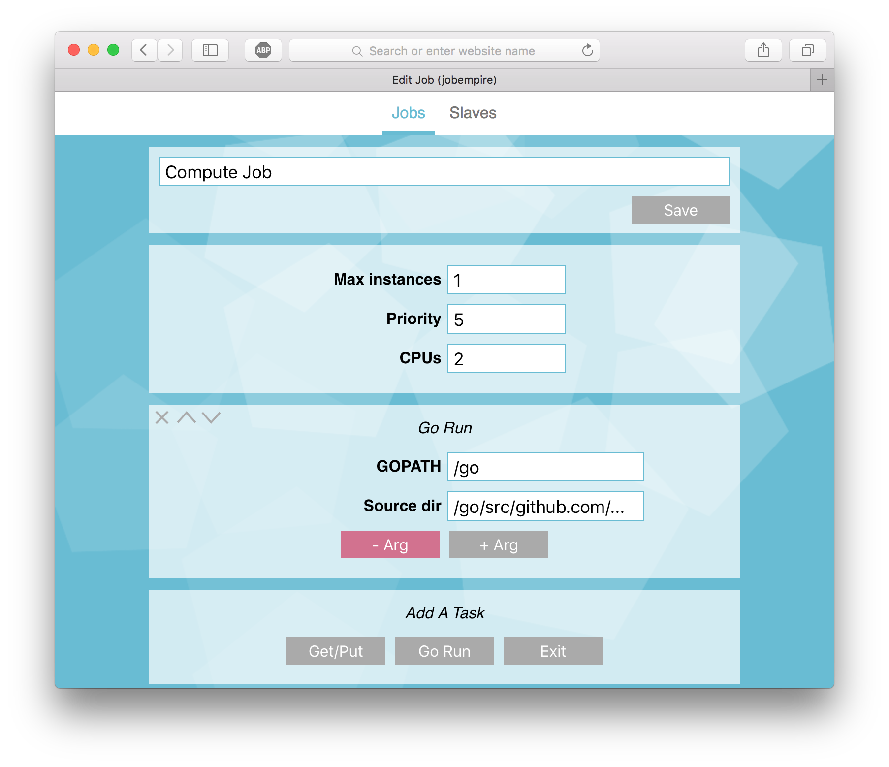
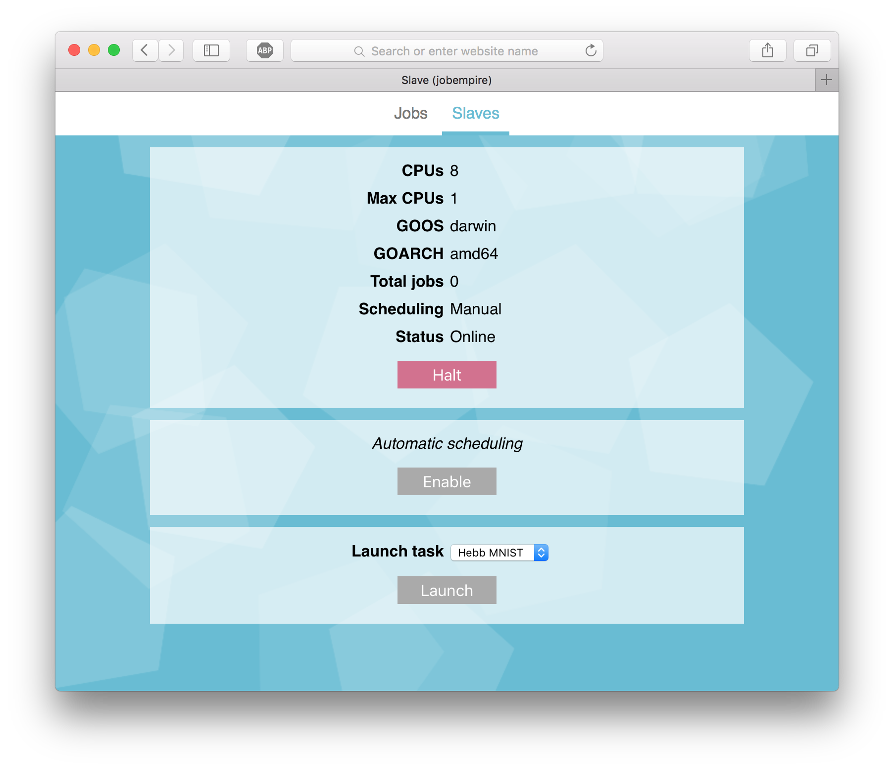
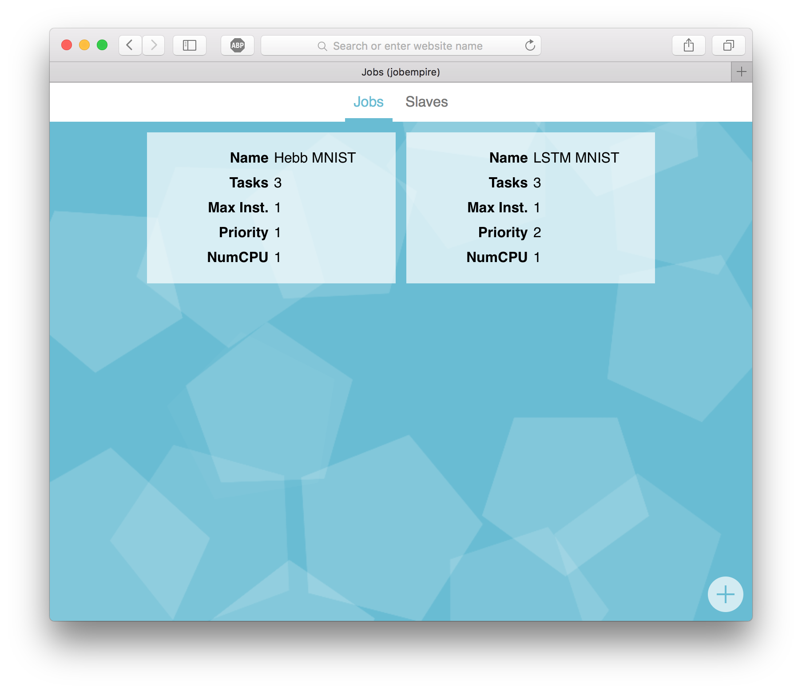
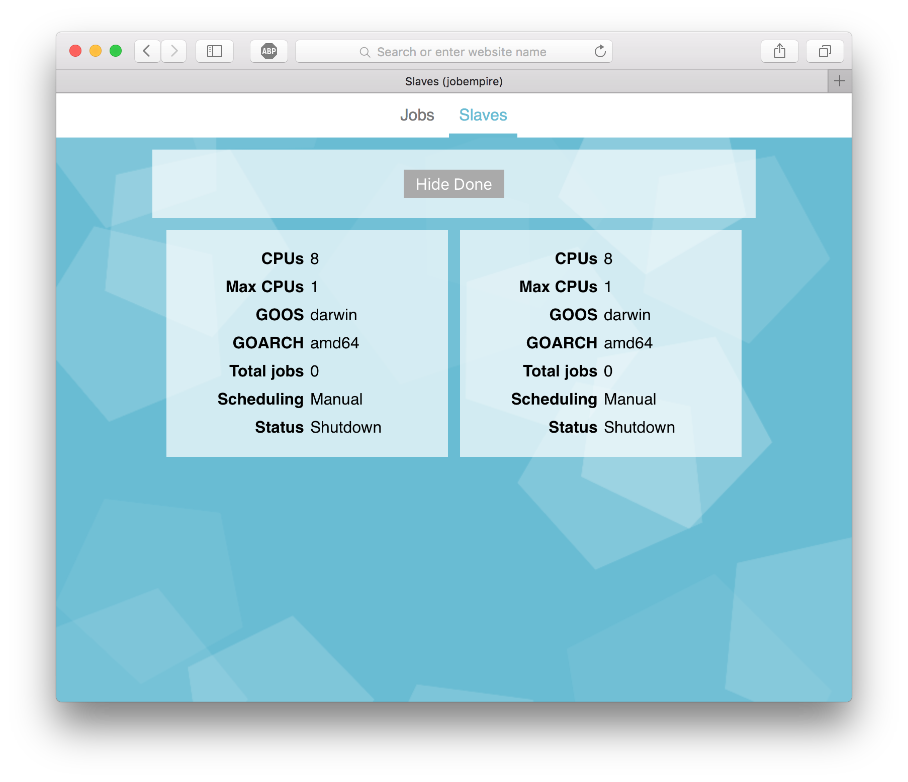

# jobempire

jobempire (pronounced "Job Empire") is a tool to manage many concurrent jobs across tens or hundreds of computers. These jobs might be high-CPU tasks, network downloads, or anything else you please. It works seamlessly with Go across multiple platforms. Thanks to Go's great built-in cross compilation, the server can cross-compile Go binaries on the fly to be deployed on any of your servers.

# Screenshots

When you use jobempire, you get an amazing user interface to go with the incredible power of automatic distributed scheduling.

